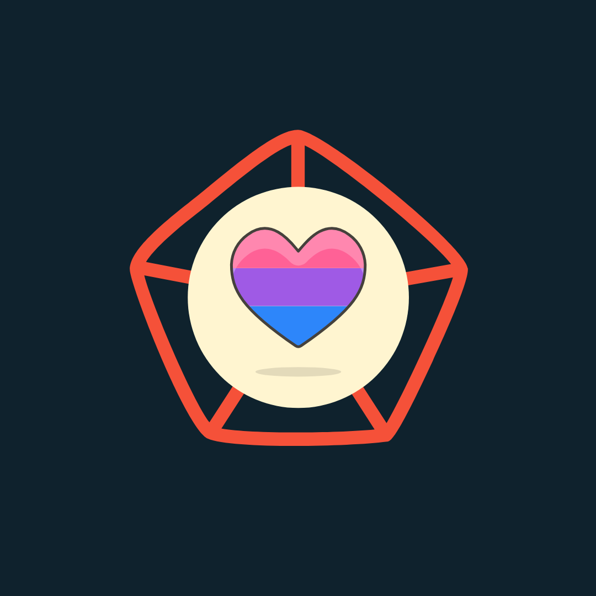
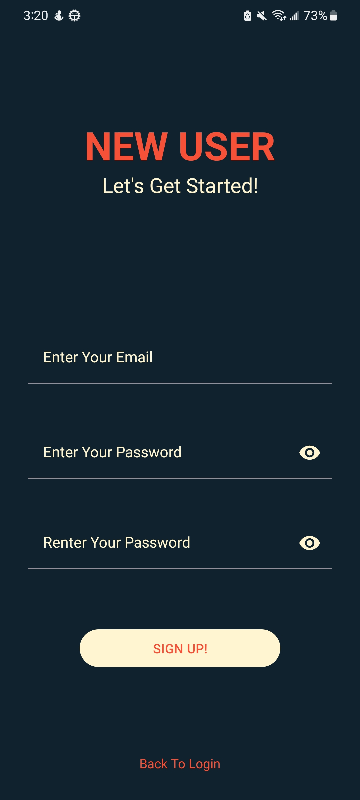
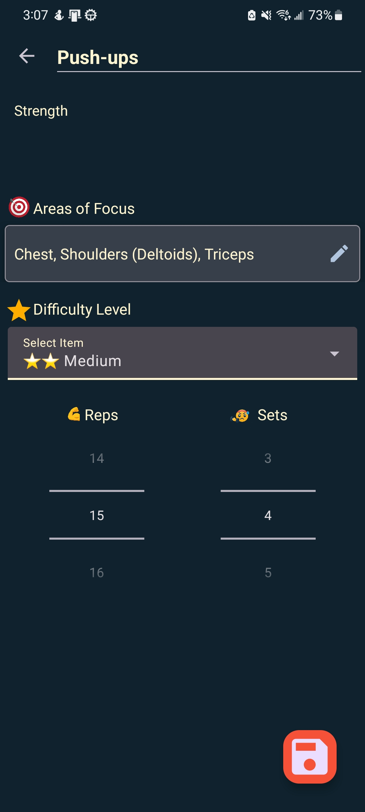
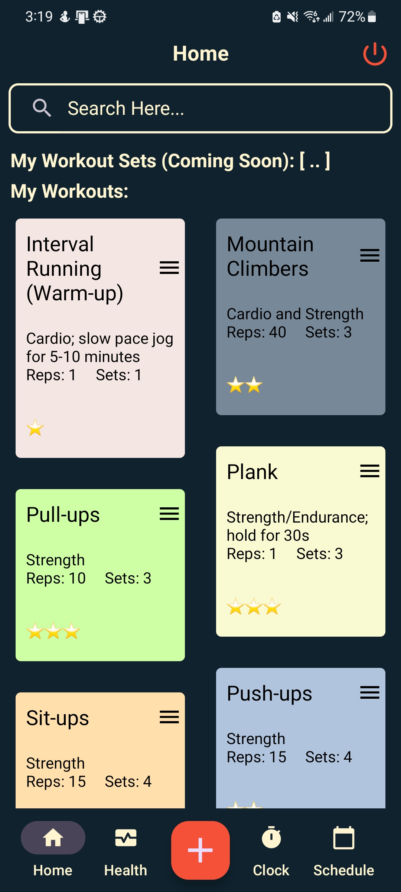

#  
# Game On! 

The Game On! project aims to develop a user-friendly app that offers a straightforward and elegant solution for creating and storing fitness data and workouts.

**Note: This project is currently a personal project and is still under development. It is not yet ready for deployment.**

## Table of Contents
- [Features](#features)
- [Installation](#installation)
- [Usage](#usage)
- [Contributing](#contributing)
- [License](#license)
- [Contact Information](#contact-information)

## Features

#    

### Current Features:
- User data management via Firebase
- Add/Edit custom workouts then save them into the user account.

### Under-development Features:
- **Track steps and other health data for convenience.**
- **Clock**: Stopwatch/timer for workouts.
- **Scheduling**: Calendar layout that keeps track of the user workouts.

## Installation

Currently, the project is still under development and is not yet ready for deployment. As a result, there are no specific installation instructions available at this time. Please stay tuned for updates on the project's progress.

## Usage

As the project is still under development, it is not yet ready for deployment. Once completed, the app will provide an intuitive and easy-to-use interface for managing fitness data and workouts. Detailed usage instructions will be provided in the future.

## Contributing

Your contributions to Game On! are highly appreciated. If you have any suggestions, ideas, or concerns about this project or its code, please feel free to create an issue and let me know. Together, we can make this app even better!

## License

The project is licensed under [GNU License](https://github.com/ManithLD/GameOn/blob/master/LICENSE). Feel free to check the license for more details.

## Contact Information

If you need to contact me regarding this project or have any questions, concerns, or feedback, please create an issue, and I'll get back to you as soon as possible.

Thank you for your interest in Game On! Let's make this fitness app a fantastic reality together!
